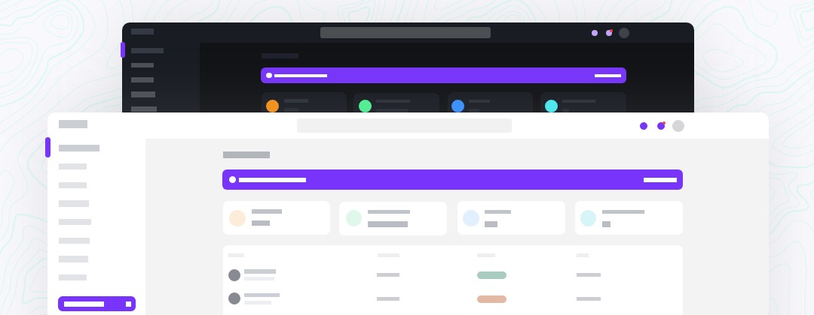

<p align="center">
    <h1>Windmill Dashboard Next.js Typescript</h1>
    <a href="https://windmill-dashboard-nextjs-typescript.vercel.app/app">
      
    </a><br>
    Four 100 scores and PWA ready. Just connect your data.
</p>

See the original project : [React Version by @estevanmaito](https://github.com/estevanmaito/windmill-dashboard-react/)
With helping from other contributors :
- [Next.JS Version by @Aldhanekaa](https://github.com/Aldhanekaa/windmill-dashboard-nextjs)
- [Typescript by @neutralboy](https://github.com/neutralboy/windmill-dashboard-react-ts)

🚀 [See it live](https://windmill-dashboard-nextjs-typescript.vercel.app/app)

This is not a template. This is a complete application, built on top of React, with all tiny details taken care of so you just need to bring the data to feed it.

Accessibility is a priority in my projects and I think it should be in yours too, so this was developed listening to real screen readers, focus traps and keyboard navigation are available everywhere.

## 📦 Features

- 🦮 Throughly accessible (developed using screen readers)
- 🌗 Dark theme enabled (load even different images based on theme)
- 🧩 Multiple (custom) components
- ⚡ Code splitting
- Tailwind CSS
- [Windmill React UI](https://windmillui.com/react-ui)
- Heroicons
- Chart.js
- PWA delivering offline-first and app-like experience

## 📚 Docs

### General components

Windmill Dashboard React is built on top of [Windmill React UI](https://windmillui.com/react-ui). You will find the documentation for every small component there.

### Routing

Routes in Windmill Dashboard are separated into two categories, sidebar ([routes/sidebar.js](routes/sidebar.js)) and general ([pages](pages)).

#### Sidebar routes

These are the routes that will show in the sidebar. They expect three properties:

- `path`: the destination;
- `name`: the name to be shown;
- `icon`: an icon to illustrate the item

Item that are used as dropdowns, like the Pages option, don't need a `path`, but expect a `routes` array of objects with `path` and `name`:

```js
// sidebar.js
{
  path: '/app/tables',
  icon: 'TablesIcon',
  name: 'Tables',
},
{
  icon: 'PagesIcon', // <-- this is used as a submenu, so no path
  name: 'Pages',
  routes: [
    // submenu
    {
      path: '/login',
      name: 'Login', // <-- these don't have icons
    },
    {
      path: '/create-account',
      name: 'Create account',
    },
```

This is a [Next.js](https://nextjs.org/) project bootstrapped with [`create-next-app`](https://github.com/vercel/next.js/tree/canary/packages/create-next-app).

## Getting Started

First, run the development server:

```bash
npm run dev
# or
yarn dev
```

Open [http://localhost:3000](http://localhost:3000) with your browser to see the result.

You can start editing the page by modifying `pages/index.tsx`. The page auto-updates as you edit the file.

[API routes](https://nextjs.org/docs/api-routes/introduction) can be accessed on [http://localhost:3000/api/hello](http://localhost:3000/api/hello). This endpoint can be edited in `pages/api/hello.ts`.

The `pages/api` directory is mapped to `/api/*`. Files in this directory are treated as [API routes](https://nextjs.org/docs/api-routes/introduction) instead of React pages.

## Learn More

To learn more about Next.js, take a look at the following resources:

- [Next.js Documentation](https://nextjs.org/docs) - learn about Next.js features and API.
- [Learn Next.js](https://nextjs.org/learn) - an interactive Next.js tutorial.

You can check out [the Next.js GitHub repository](https://github.com/vercel/next.js/) - your feedback and contributions are welcome!

## Deploy on Vercel

The easiest way to deploy your Next.js app is to use the [Vercel Platform](https://vercel.com/new?utm_medium=default-template&filter=next.js&utm_source=create-next-app&utm_campaign=create-next-app-readme) from the creators of Next.js.

Check out our [Next.js deployment documentation](https://nextjs.org/docs/deployment) for more details.
